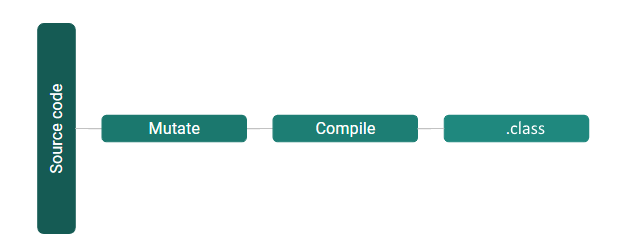

# Stryker4s

----

- Versie 0.1.0 eind 2018 👶
- Source code muteren
- Scala-specifieke mutaties

----

## Function mutators!

| Original           | Mutated            |
| ------------------ | ------------------ |
| `a.filter(b)`      | `a.filterNot(b)`   |
| `a.filterNot(b)`   | `a.filter(b)`      |
| `a.exists(b)`      | `a.forall(b)`      |
| `a.forall(b)`      | `a.exists(b)`      |
| more stuff!        | lots more! 🎁 |

----

## Careful what you mutate for

```scala
def addTwo(a: Int): Boolean = {
  a + 2
  // Mutant 1: a - 2 👍
}
```


```scala
def addWorld(a: String): Boolean = {
  a + "World!"
  // Mutant 1: a - "World!" 💥
}
```
<!-- .element class="fragment" data-fragment-index="1" -->

----

```scala
def wat() = {
  var a = 2
  val toAdd = doSomeComplicatedMaths
  a += toAdd
}
```


<!-- .element class="fragment" data-fragment-index="1" -->

----


## The Pitest way


----

## The Stryker (JS/TS) way


Not for long: [https://github.com/stryker-mutator/stryker/issues/1514](https://github.com/stryker-mutator/stryker/issues/1514)
----

## The Stryker4s way




----

## Mutation switching


----

```scala
def greaterThan(a: Int, b: Int): Boolean = {
  a > b
  // Mutant 1: a >= b
  // Mutant 2: a < b
  // Mutant 3: a == b
}
```

Mutate to:

<!-- .element class="fragment" data-fragment-index="1" -->

```scala
def greaterThan(a: Int, b: Int): Boolean = {
  sys.env.get("ACTIVE_MUTATION") match {
    case Some("0") =>
      a >= b // Mutant 1
    case Some("1") =>
      a < b // Mutant 2
    case Some("2") =>
      a == b // Mutant 3
    case _ =>
      a > b // <-- Original mutation 
  }
}
```

<!-- .element class="fragment" data-fragment-index="1" -->
