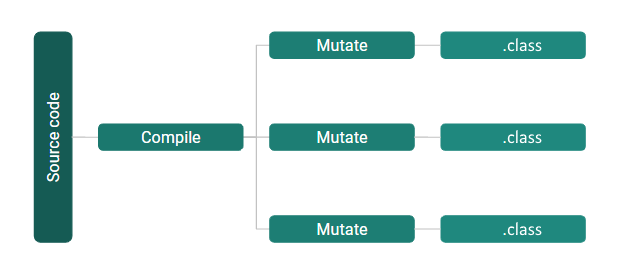

# Stryker4s

----

## Scala

???

----

## Nice to meet you 🤝

- Versie 0.1.0 eind 2018 👶
- Laatste versie 0.8.1 🔮
- Source code muteren
- Scala-specifieke mutaties
- Fancy reporting

----

## Function mutators!

| Original           | Mutated            |
| ------------------ | ------------------ |
| `a.filter(b)`      | `a.filterNot(b)`   |
| `a.filterNot(b)`   | `a.filter(b)`      |
| `a.exists(b)`      | `a.forall(b)`      |
| `a.forall(b)`      | `a.exists(b)`      |
| more stuff!        | lots more! 🎁 |

----
<!-- .slide: data-auto-animate data-id="slide-mutability"-->

```scala [4]
def mutability() = {
  var a = 2
  val toAdd = doSomeComplicatedMaths
  a += toAdd
}
```


----
<!-- .slide: data-auto-animate data-id="slide-mutability"-->

```scala [4]
def mutability() = {
  var a = 2
  val toAdd = doSomeComplicatedMaths
  a += toAdd
}
```


----

<!-- .slide: data-auto-animate data-id="slide-addtwo" -->

<h2>Careful what you<br>mutate for</h2>

```scala " data-line-numbers=true
def addTwo(a: Int): Boolean = {
  a + 2
}
```
<!-- .element data-id="code-animation" -->

----

<!-- .slide: data-auto-animate data-id="slide-addtwo" -->

<h2>Careful what you<br>mutate for</h2>


```scala " data-line-numbers=true
def addTwo(a: Int): Boolean = {
  a - 2 // 👍
}
```
<!-- .element data-id="code-animation" -->

----

<!-- .slide: data-auto-animate -->

<h2>Careful what you<br>mutate for</h2>

```scala " data-line-numbers=true
def addWorld(a: String): Boolean = {
  a + "World!"
}
```
<!-- .element data-id="code-animation-2" -->

----

<!-- .slide: data-auto-animate -->

<h2>Careful what you<br>mutate for</h2>

```scala " data-line-numbers=true
def addWorld(a: String): Boolean = {
  a - "World!" // 💥
}
```
<!-- .element data-id="code-animation-2" -->

----

## The Stryker (JS/TS) way


Not for long: [https://github.com/stryker-mutator/stryker/issues/1514](https://github.com/stryker-mutator/stryker/issues/1514)

Note: niet geschikt voor Scala, want...
----

## The Pitest way



TODO: Slecht weg-paint.netten

Note: niet geschikt voor Scala, want...

----

## The Stryker4s way


----

## Mutation switching


----

<!-- .slide: data-auto-animate -->

## Mutation switching in practice

```scala " data-line-numbers=true
def greaterThan(a: Int, b: Int): Boolean = {
  a > b
}
```
<!-- .element data-id="code-animation" -->

----

<!-- .slide: data-auto-animate -->

## Mutation switching in practice

```scala " data-line-numbers=true
def greaterThan(a: Int, b: Int): Boolean = {
  // Mutant 1: a >= b
  // Mutant 2: a < b
  // Mutant 3: a == b
  a > b
}
```
<!-- .element data-id="code-animation" -->

----

<!-- .slide: data-auto-animate -->

## Mutation switching in practice

```scala " data-line-numbers=true
def greaterThan(a: Int, b: Int): Boolean = {
  sys.env("ACTIVE_MUTATION") match {
    case "0" => a >= b // Mutant 1
    case "1" => a < b  // Mutant 2
    case "2" => a == b // Mutant 3
    case _   => a > b  // Original mutation
  }
}
```
<!-- .element data-id="code-animation" -->

Note: nadelen
